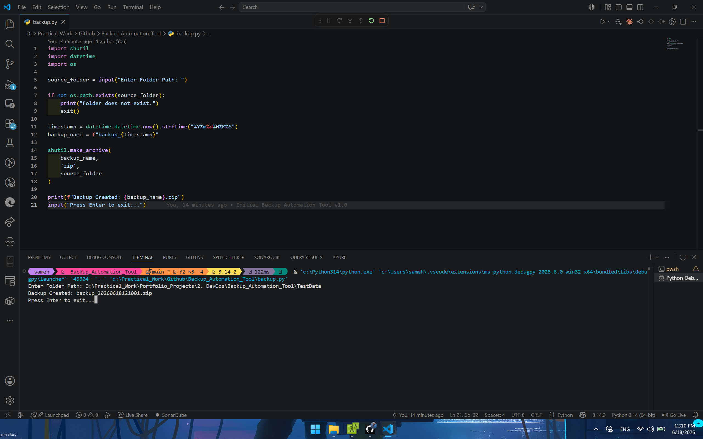
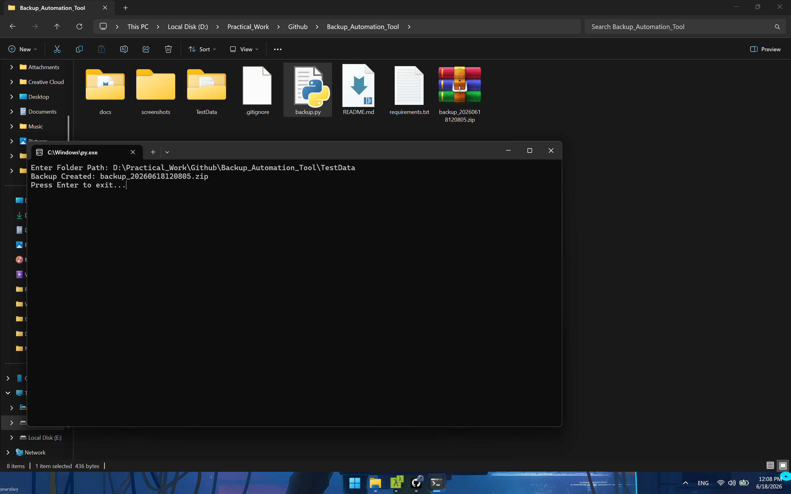
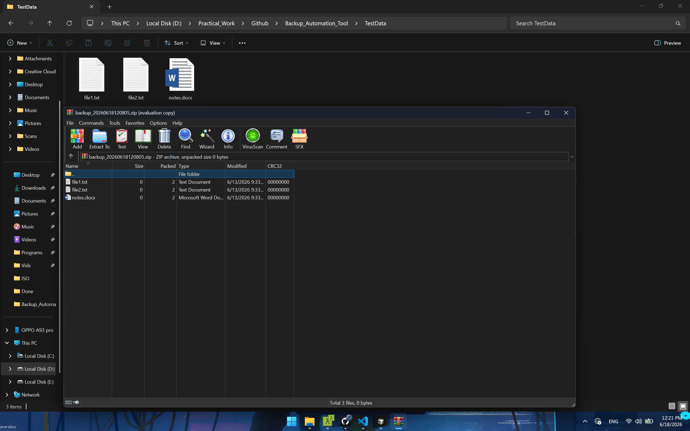

# Backup Automation Tool

## Overview

A Python-based automation tool that creates compressed backups of folders.

---

## Features

- Folder Backup
- ZIO Compression
- Timestamp-based Naming

---

## Technologies

- Python
- shutil
- datetime
- os

---

### Usage

~~~bash
python backup.py
~~~

## Screenshots

---

## Feature Improvement

- Backup Logs
- Automatic Backup Directory
- Multiple Folder Backup
- Scheduled Backups
